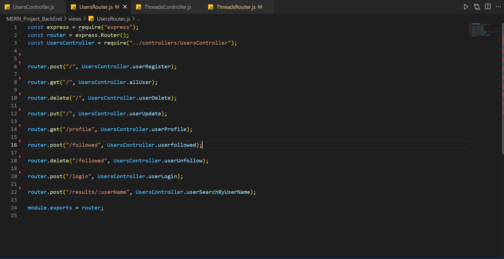
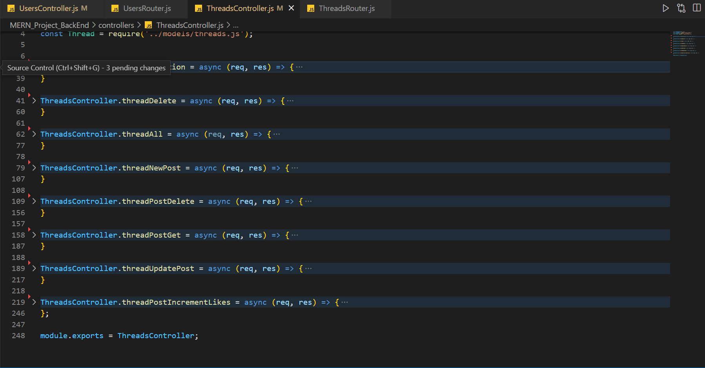
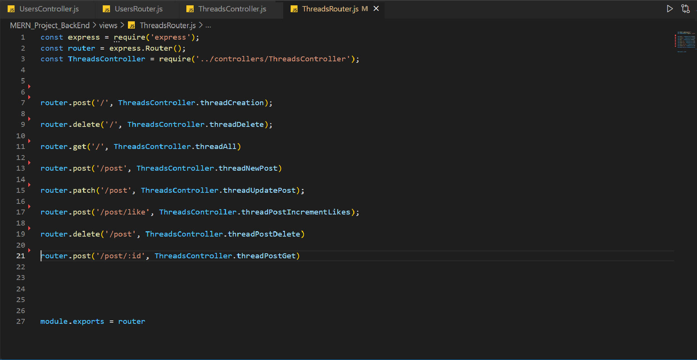

# PROYECTO MERN BACKEND.

Este proyecto consiste en hacer una App de una red social donde los distintos usuarios puedan compartir opiniones sobre distintos temas, darle a "like" si algun post le gusta, 
entre otras cosas. Utilzamos el modelo MVC (modelo, vista y controlador), ya se los explicare mas adelante. Utilizamos MongoDB de sistema de base de datos, Atlas para deployar la misma 
y Mongoose es una biblioteca de programación orientada a objetos de JavaScript que crea una conexión entre MongoDB y el marco de la aplicación web Express.

## Instrucciones
<ol>
  <li>Comenzamos con clonar este repositorio en tu ordenador con el comando Git clone URL </li>
   <li>npm init -y para arrancar node</li>
    <li>npm i para descargar todas las dependecias que use en este proyecto como:  
      <ul>
         <li>Mongoose</li>
         <li>MongoDB</li>
         <li>axios</li>
         <li>express</li>
         <li>nodemon</li>
         <li>cors</li>
         <li>jsonwebtoken</li>
         <li>bcrypt</li>
      </ul>
 
 
 
 
      

      
  <li> npm run dev, para levantar el servidor.  Las peticiones que le haras al mismo se haran a travez de nuestro Frontend(https://master.d3jig09ot1g2k5.amplifyapp.com/)</li>
  </ol>
# Habiendo dicho que usamos el patron MVC mostraremos el de cada tabla usado.
 
## Estos son los endpoints de USERS y sus funciones van redirigidos a la carpeta Userscontroller.

  
 router.post("/", UsersController.userRegister);

 router.get("/", UsersController.allUser);

 router.delete("/", UsersController.userDelete);

 router.put("/", UsersController.userUpdate);

router.get("/profile", UsersController.userProfile);

router.post("/followed", UsersController.userfollowed);

router.delete("/followed", UsersController.userUnfollow);

router.post("/login", UsersController.userLogin);

router.post("/results/:userName", UsersController.userSearchByUserName);

## Estos son las distintas funciones que tiene el UsersControllers.

## Estos son los endpoints de THREADS y sus funciones van redirigidos a la carpeta ThreadsControllers.

 router.post('/', ThreadsController.threadCreation);

 router.delete('/', ThreadsController.threadDelete);

 router.get('/', ThreadsController.threadAll)

 router.post('/post', ThreadsController.threadNewPost)

 router.patch('/post', ThreadsController.threadUpdatePost);

 router.post('/post/like', ThreadsController.threadPostIncrementLikes);

router.delete('/post', ThreadsController.threadPostDelete)

 router.post('/post/:id', ThreadsController.threadPostGet)
 
 

## Estos son las distintas funciones que tiene el ThreadsControllers.

### Devs: Juan Pablo Parra Labarca(https://github.com/parra1996), Andreu Martinez (https://github.com/AndreuMartinezG) y Alvaro Marzo (https://github.com/alvmara).
        

